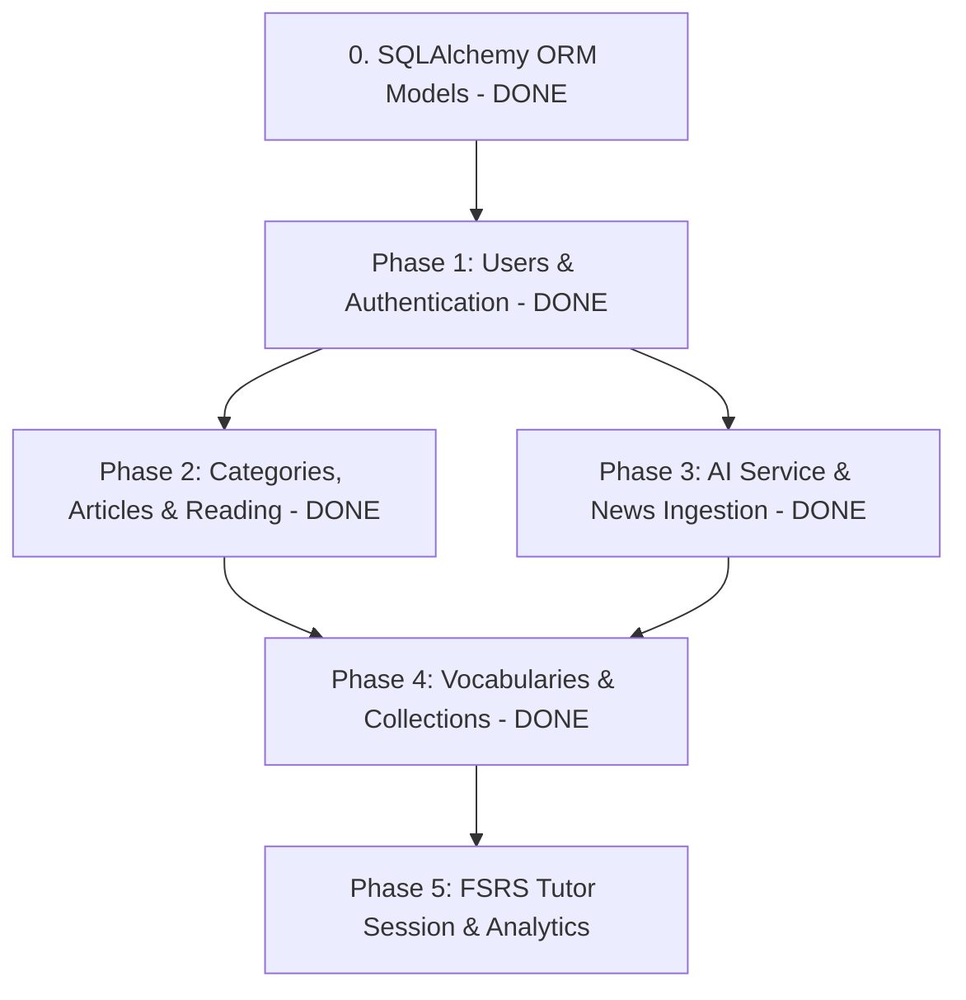

# Kế hoạch & Thứ tự Chuyển đổi Modules từ NestJS sang FastAPI

Tài liệu này xác định thứ tự chuyển đổi tối ưu nhất cho toàn bộ 12 modules và 17 controllers của Vocab Mate từ NestJS sang FastAPI, đảm bảo tính liên tục của dữ liệu, giảm thiểu sự phụ thuộc chéo và cho phép kiểm thử độc lập từng giai đoạn.

---

## QUY CHUẨN BẮT BUỘC: Tuân thủ 3 Skills cài đặt trong Repo

Mọi code viết trong repository `vocab-mate-backend-python` bắt buộc phải tuân thủ nghiêm ngặt 3 kỹ năng đã cài đặt tại `.agents/skills/`:

### 1. Quy chuẩn Skill `fastapi` (`.agents/skills/fastapi/SKILL.md`)
- **Cú pháp `Annotated`**: Luôn sử dụng kiểu `Annotated` cho mọi dependency (`CurrentUserDep`, `DbSessionDep`, ...) và parameters (`Query`, `Path`, `Header`, `File`, `Cookie`). Tạo type alias cho các dependency tái sử dụng.
- **Cấm Ellipsis (`...`)**: Không dùng `...` làm giá trị mặc định cho parameter hoặc Pydantic model field (ví dụ: dùng `File()` thay vì `File(...)`).
- **Khai báo Return Type**: Mọi router endpoint bắt buộc khai báo kiểu trả về tường minh (ví dụ: `-> BaseResponse[MyAccountDto]`).
- **Cấu hình Router**: Khai báo `prefix`, `tags`, và shared dependencies trực tiếp trên `APIRouter(...)`.
- **Hiệu năng & Response**: Tuyệt đối không dùng `ORJSONResponse` hay `UJSONResponse` (đã deprecated). Để Pydantic tự động serialize.
- **Không dùng Pydantic `RootModel`**: Sử dụng kiểu dữ liệu thông thường kết hợp `Annotated` và Pydantic Field/Body.
- **Nguyên tắc Async vs Sync**:
  - Không chạy blocking I/O (mạng đồng bộ, file đồng bộ) hoặc CPU-bound nặng (như Bcrypt hashing, upload ảnh đồng bộ) trực tiếp trong `async def`.
  - Bắt buộc bọc các tác vụ blocking bằng `await asyncio.to_thread(...)` hoặc Asyncer để tránh làm nghẽn FastAPI event loop.
- **Một HTTP operation mỗi hàm**: Mỗi hàm endpoint chỉ đảm nhiệm duy nhất 1 HTTP method.

### 2. Quy chuẩn Skill `python-fastapi-patterns` (`.agents/skills/python-fastapi-patterns/SKILL.md`)
- **Phân lớp kiến trúc (Layered Architecture)**:
  - **Thin Routers**: Router chỉ parse HTTP request, inject dependencies, ủy quyền xử lý cho Service và trả về response envelope.
  - **Service Layer**: Nơi sở hữu 100% logic nghiệp vụ, transaction, validation logic.
  - **Data Access Layer**: Sử dụng SQLAlchemy 2.0 async session và models.
- **Chuẩn hóa Error Response Envelope**:
  - 100% phản hồi lỗi từ API (bao gồm cả lỗi validation 400, auth 401, permission 403, not found 404, conflict 409, server error 500) phải tuân thủ định dạng envelope chuẩn của hệ thống:
    ```json
    {
      "success": false,
      "error": {
        "code": "ERROR_CODE_STRING",
        "message": "Human readable error message",
        "details": ["Optional field details"]
      }
    }
    ```
- **Pydantic v2 Models**:
  - Khai báo `model_config = ConfigDict(from_attributes=True)` trên các response DTOs ánh xạ từ ORM entity.
  - Đặt validation boundaries chặt chẽ (`min_length`, `max_length`, `pattern`, `ge`, `le`).
- **Bảo vệ an toàn quản trị (Admin Invariants)**:
  - Admin không được phép tự khoá/tự vô hiệu hoá tài khoản của chính mình.
  - Admin không được phép tự hạ quyền (demote) của chính mình.
  - Hệ thống phải luôn đảm bảo còn ít nhất 1 Administrator ở trạng thái `ACTIVE`.

### 3. Quy chuẩn Skill `google-python-docstrings` (`.agents/skills/google-python-docstrings/SKILL.md`)
- Mọi module, class, public function và method bắt buộc có docstring viết theo **Google Python Style Guide**:
  - **Dòng tóm tắt (Summary line)**: Tối đa 80 ký tự, bắt đầu viết hoa và kết thúc bằng dấu chấm (`.`).
  - **Dòng trống**: Ngăn cách giữa summary và nội dung chi tiết.
  - **Định dạng `Args:`**: Bắt buộc ghi rõ kiểu dữ liệu theo format `name (type): Description.`.
  - **Định dạng `Returns:`**: Theo format `type: Description.`. (Dùng `Yields:` cho generator).
  - **Định dạng `Raises:`**: Liệt kê các Exception cụ thể mà caller cần biết và điều kiện kích hoạt.
  - **Bắt buộc có `Example:`**: Mọi public function/method phải có block `Example:` sử dụng doctest style (`>>>`).
  - **Định dạng `Attributes:` cho Class**: Liệt kê các thuộc tính/cột công khai theo format `name (type): Description.`.

---

## 0. Giai đoạn nền tảng: Khai báo SQLAlchemy ORM Models (ĐÃ HOÀN THÀNH)
Đã định nghĩa toàn bộ SQLAlchemy Models khớp 100% với PostgreSQL schema hiện có (trong thư mục `app/models/`):
- [x] **Enums** (`app/models/enums.py`): `UserRole`, `UserStatus`, `CefrLevel`, `ArticleStatus`, `AiGenerationStatus`, `TermOrigin`, `TermReviewStatus`, `ReadingStatus`, `FsrsCardState`, `TutorSessionStatus`, `TutorSessionItemStatus`, `TutorQuestionType`.
- [x] **Core Models**:
  - `users.py`: `User`, `RefreshSession`
  - `categories.py`: `Category`
  - `articles.py`: `Article`, `ArticleSentence`, `ArticleSentenceTerm`
  - `reading.py`: `UserArticleProgress`
  - `vocabularies.py`: `UserVocabulary`
  - `collections.py`: `VocabularyCollection`, `VocabularyCollectionItem`
  - `tutor.py`: `TutorSession`, `TutorSessionItem`

---

## Lộ trình chuyển đổi từng Module (Phân theo 5 Giai đoạn)



---

### GIAI ĐOẠN 1: Quản lý Người dùng & Xác thực (ĐÃ HOÀN THÀNH & NGHIỆM THU)
> *Trạng thái:* **100% Hoàn thành, đã chuẩn hóa theo 3 skills, 5/5 automated tests pass.**

#### 1. Module `users` — [x] HOÀN THÀNH
- **Tập tin đã tạo**:
  - `app/modules/users/schemas.py`: DTO UserProfile, UserUpdate, AdminUserDto, AdminUpdateStatusDto, AdminUpdateRoleDto.
  - `app/modules/users/service.py`: Truy vấn profile, cập nhật mục tiêu học tập, quản lý admin, upload avatar lên Cloudinary qua threadpool không block event loop, bảo vệ self-lockout và last active admin.
  - `app/modules/users/router.py`:
    - `GET /api/v1/users/me` — Lấy thông tin user hiện tại.
    - `PATCH /api/v1/users/me` — Cập nhật profile (dailyStudyMinutes, learningGoal, currentCefrLevel).
    - `POST /api/v1/users/me/avatar` — Upload ảnh đại diện (dùng `File()` không ellipsis).
    - `GET /api/v1/admin/users`, `PATCH /api/v1/admin/users/{id}/status`, `PATCH /api/v1/admin/users/{id}/role`.

#### 2. Module `auth` — [x] HOÀN THÀNH
- **Tập tin đã tạo**:
  - `app/modules/auth/schemas.py`: RegisterDto, LoginDto, ChangePasswordDto, AuthDataDto, AccessTokenDataDto.
  - `app/modules/auth/service.py`: Hash mật khẩu bcrypt, tạo Access Token JWT, xoay vòng refresh token trong DB (`RefreshSession` table) kèm Token Rotation, bảo vệ chống email enumeration.
  - `app/modules/auth/router.py`:
    - `POST /api/v1/auth/register`
    - `POST /api/v1/auth/login`
    - `POST /api/v1/auth/refresh` — Đọc HttpOnly cookie `/api/v1/auth`, xoay vòng refresh token.
    - `POST /api/v1/auth/logout`
    - `PATCH /api/v1/auth/change-password`
  - `app/common/deps.py`: `CurrentUserDep`, `CurrentAdminDep`, `DbSessionDep`, `RefreshTokenPayloadDep`.
  - `app/common/exceptions.py` & `app/main.py`: Chuẩn hóa 100% lỗi sang Error Envelope.
  - `tests/test_auth.py`, `tests/test_users_admin.py`: Đạt 100% test coverage cho toàn bộ flow.

---

### GIAI ĐOẠN 2: Nội dung & Tiến độ Đọc báo (Content Discovery) — [x] ĐÃ HOÀN THÀNH & NGHIỆM THU
> *Trạng thái:* **100% Hoàn thành, 12/12 automated tests pass, 0 ruff linter errors.**

#### 3. Module `categories` — [x] ĐÃ HOÀN THÀNH
- **APIs**:
  - `GET /api/v1/categories`, `GET /api/v1/categories/{slug}` (Public)
  - `POST /api/v1/admin/categories`, `GET /api/v1/admin/categories/{id}`, `PATCH /api/v1/admin/categories/{id}`, `PATCH /api/v1/admin/categories/{id}/status`, `DELETE /api/v1/admin/categories/{id}` (Admin)

#### 4. Module `articles` — [x] ĐÃ HOÀN THÀNH
- **Helpers**:
  - `app/common/data/cefr_dict.json`: 4,954 từ vựng phân loại CEFR A1-C2 từ `cefr-analyzer`.
  - `app/modules/articles/helpers/html_sanitizer.py`: Làm sạch HTML an toàn với `BeautifulSoup`.
  - `app/modules/articles/helpers/sentence_parser.py`: Phân tách câu bọc `<span data-sentence-id>`.
  - `app/modules/articles/helpers/term_marker.py`: Đánh dấu, chèn, thay thế và gỡ bỏ từ vựng `<span data-term-id>`.
  - `app/modules/articles/helpers/cefr_analyzer.py`: NLTK lemmatizer + CEFR dictionary scoring.
- **APIs**:
  - `GET /api/v1/articles` — Catalog công khai phân trang, lọc category, CEFR level, search query `q`.
  - `GET /api/v1/articles/{slug}` — Chi tiết bài viết công khai.
  - Admin endpoints: CRUD (`POST`, `GET`, `PATCH`, `DELETE /api/v1/admin/articles`), `POST .../parse-content`, `POST .../analyze`, `POST .../publish`, `POST .../archive`, `POST .../restore-draft`.
  - Admin Sentence & Term endpoints:
    - `GET /api/v1/admin/articles/{id}/sentences` — Danh sách câu phân trang theo `sentence_order`.
    - `GET /api/v1/admin/articles/{id}/sentences/{sentence_id}` — Chi tiết câu kèm danh sách từ vựng liên kết.
    - `PATCH /api/v1/admin/articles/{id}/sentences/{sentence_id}` — Cập nhật bản dịch và trạng thái câu.
    - `POST /api/v1/admin/articles/{id}/sentences/{sentence_id}/terms` — Thêm thủ công từ vựng, tự động bọc thẻ HTML marker.
    - `GET /api/v1/admin/articles/{id}/terms` — Danh sách từ vựng có bộ lọc đa tiêu chí (sentence_id, is_active, cefr_level, term_type).
    - `GET /api/v1/admin/articles/{id}/terms/{term_id}` — Chi tiết từ vựng kèm ngữ cảnh câu cha.
    - `PATCH /api/v1/admin/articles/{id}/terms/{term_id}` — Cập nhật thuộc tính từ vựng và đồng bộ text marker.
    - `POST /api/v1/admin/articles/{id}/terms/{term_id}/approve` — Duyệt từ vựng AI, kích hoạt và gắn marker HTML.
    - `POST /api/v1/admin/articles/{id}/terms/{term_id}/reject` — Từ chối từ vựng AI (không tạo marker HTML).
    - `DELETE /api/v1/admin/articles/{id}/terms/{term_id}` — Xóa từ vựng chưa lưu và unwrap marker HTML sạch sẽ.

#### 5. Module `reading` — [x] ĐÃ HOÀN THÀNH
- **APIs**:
  - `GET /api/v1/reading/articles/{slug}` — Personalized reader payload với sanitized HTML, CEFR term highlights, progress.
  - `GET /api/v1/reading/progress/{article_id}` — Lấy tiến độ đọc (hoặc default 0% READING).
  - `PUT /api/v1/reading/progress/{article_id}` — Cập nhật tiến độ đọc %.
  - `POST /api/v1/reading/progress/{article_id}/complete` — Đánh dấu hoàn thành 100% COMPLETED.
  - `DELETE /api/v1/reading/progress/{article_id}` — Xóa tiến độ đọc (204 No Content).
  - `GET /api/v1/reading/history` — Lịch sử bài báo đã đọc phân trang.
  - `GET /api/v1/reading/articles/{article_id}/terms/{term_id}` — Tra cứu chi tiết từ vựng ngữ cảnh.

---

### GIAI ĐOẠN 3: Hạ tầng AI & Thu thập Tin tức (AI Ingestion & Analysis) — [x] ĐÃ HOÀN THÀNH & NGHIỆM THU
> *Lý do:* Tạo động cơ AI tự động phân tích độ khó bài báo và hỗ trợ tra cứu nghĩa từ vựng theo ngữ cảnh.

#### 6. Module `ai` (Core AI Service) — [x] ĐÃ HOÀN THÀNH
- **Tập tin**:
  - `app/modules/ai/service.py`: Tích hợp Gemini (`google-genai`) làm luồng chính và Groq (`groq`) làm fallback khi timeout/lỗi.
  - Pydantic Structured Output cho 3 tác vụ chính:
    1. `TermEnrichment`: Nghĩa ngữ cảnh tiếng Việt (1-6 từ, không dấu phẩy), định nghĩa, ví dụ, dịch câu.
    2. `SessionWarmup`: Câu chuyện thực tế ngắn lồng từ vựng (`**word** (nghĩa tiếng Việt)`).
    3. `TutorActivity`: Trắc nghiệm MCQ, điền từ Cloze, gõ từ Recall, Micro-lesson retest.
  - Lazy enrichment tích hợp sẵn trong `ReadingService.get_contextual_term` với caching status `READY`.
  - Tự động kiểm thử: `tests/test_ai.py` (5/5 tests PASSED).

#### 7. Module `news_ingestion` — [x] ĐÃ HOÀN THÀNH
- **Tập tin**:
  - `app/modules/news_ingestion/guardian_client.py`: Client gọi The Guardian Content API kèm retry, timeout, fallback.
  - `app/modules/news_ingestion/news_content_service.py`: Validate & sanitize HTML, lọc bài viết rác / placeholder stubs.
  - `app/modules/news_ingestion/url_canonicalizer.py`: Chuẩn hóa URL, loại bỏ tracking parameters (`utm_*`, `fbclid`, ...).
  - `app/modules/news_ingestion/service.py`: Quản lý tìm kiếm và đồng bộ bài báo về dạng Draft.
- **APIs**:
  - `GET /api/v1/admin/news/search` — Tìm kiếm bài báo qua The Guardian Content API.
  - `POST /api/v1/admin/news/sync` — Tự động nhập bài báo về dạng Draft, tự động phân giải Category và parse sentences.
  - Tự động kiểm thử: `tests/test_news_ingestion.py` (4/4 tests PASSED).

#### 8. Hoàn thiện Pipeline phân tích bài báo: — [x] ĐÃ HOÀN THÀNH
- `POST /api/v1/admin/articles/{id}/analyze` — Tự động trích xuất từ khóa, lemmatize qua NLTK, phân tích cấp độ CEFR và gán thẻ term markers.

---

### GIAI ĐOẠN 4: Quản lý Từ vựng Cá nhân & Bộ sưu tập — [x] ĐÃ HOÀN THÀNH & NGHIỆM THU
> *Trạng thái:* **100% Hoàn thành, đã chuẩn hóa theo 3 skills, 2/2 automated tests pass.**

#### 9. Module `vocabularies` — [x] ĐÃ HOÀN THÀNH
- **APIs**:
  - `GET /api/v1/vocabularies` — Lấy danh sách từ vựng cá nhân phân trang, lọc theo `cefrLevel`, `collectionId`, tìm kiếm `q`, sắp xếp `sort` (oldest/newest).
  - `POST /api/v1/vocabularies` — Lưu snapshot từ vựng ngữ cảnh (yêu cầu thuộc bài báo đã `PUBLISHED`, kiểm tra chống duplicate 409).
  - `GET /api/v1/vocabularies/{user_vocabulary_id}` — Chi tiết từ vựng kèm danh sách collection liên kết và metadata bài báo gốc.
  - `DELETE /api/v1/vocabularies/{user_vocabulary_id}` — Xóa từ vựng cá nhân (204 No Content).

#### 10. Module `collections` — [x] ĐÃ HOÀN THÀNH
- **APIs**:
  - `GET /api/v1/collections` — Danh sách bộ sưu tập phân trang kèm đếm số lượng từ vựng (`vocabularyCount`).
  - `POST /api/v1/collections` — Tạo mới bộ sưu tập (chống trùng tên 409).
  - `GET /api/v1/collections/{collection_id}` — Lấy chi tiết bộ sưu tập.
  - `PATCH /api/v1/collections/{collection_id}` — Cập nhật tên bộ sưu tập (chống trùng tên 409).
  - `DELETE /api/v1/collections/{collection_id}` — Xóa bộ sưu tập và tự động dọn dẹp các từ vựng chỉ thuộc riêng bộ sưu tập này.
  - `GET /api/v1/collections/{collection_id}/items` — Lấy danh sách từ vựng trong bộ sưu tập phân trang.
  - `POST /api/v1/collections/{collection_id}/items` — Thêm hàng loạt từ vựng đã lưu vào bộ sưu tập.
  - `DELETE /api/v1/collections/{collection_id}/items/{user_vocabulary_id}` — Gỡ từ vựng ra khỏi bộ sưu tập (204 No Content).

---

### GIAI ĐOẠN 5: Gia sư AI FSRS & Thống kê (Spaced Repetition & Analytics) — [x] ĐÃ HOÀN THÀNH
> *Trạng thái:* **100% Hoàn thành, tuân thủ 3 skills (fastapi, python-fastapi-patterns, google-python-docstrings), 25/25 automated tests pass toàn hệ thống.**

#### 11. Module `tutor` — [x] ĐÃ HOÀN THÀNH
- **Tập tin**:
  - `app/modules/tutor/schemas.py`: Các DTO Pydantic chuẩn hoá cho session lifecycle, candidate pool, activity item, và submission.
  - `app/modules/tutor/fsrs_service.py`: Tích hợp thư viện `fsrs.Scheduler(desired_retention=0.9)`, tính toán Card snapshot, study dates theo múi giờ `Asia/Ho_Chi_Minh`.
  - `app/modules/tutor/rating_service.py`: Chính sách xếp hạng FSRS xác định (Rating 1..4, trần Rating.Hard cho trắc nghiệm nhận diện).
  - `app/modules/tutor/candidate_service.py`: Thuật toán chọn ứng viên theo thứ tự ưu tiên: relearning > learning > review > new word theo ngân sách thời gian `daily_study_minutes`.
  - `app/modules/tutor/service.py`: Điều phối phiên học gia sư, snapshot quan hệ an toàn với SQLAlchemy async greenlet, chấm điểm server-side bảo mật (không rò rỉ đáp án khi item chưa trả lời).
  - `app/modules/tutor/router.py`: Router `/api/v1/tutor-sessions`.
- **APIs**:
  - `GET /api/v1/tutor-sessions/today-status`: Kiểm tra trạng thái học hôm nay (completed, in-progress, hoặc new).
  - `POST /api/v1/tutor-sessions/start`: Khởi tạo phiên học mới hoặc khôi phục phiên đang dở dang (idempotent).
  - `GET /api/v1/tutor-sessions/current`: Chi tiết phiên hiện tại với item pending được che giấu đáp án.
  - `POST /api/v1/tutor-sessions/{sessionId}/items/{itemId}/submit`: Nộp câu trả lời, chấm điểm server-side, cập nhật FSRS memory state.
  - `POST /api/v1/tutor-sessions/{sessionId}/abandon`: Hủy phiên học đang diễn ra.
  - `GET /api/v1/tutor-sessions/history`: Lịch sử phiên học phân trang keyset theo `studyDate`.
  - `GET /api/v1/tutor-sessions/{id}`: Chi tiết phiên học kèm câu trả lời và giải thích chi tiết.

#### 12. Module `analytics` — [x] ĐÃ HOÀN THÀNH
- **Tập tin**:
  - `app/modules/analytics/schemas.py`: Toàn bộ DTO thống kê người học và báo cáo quản trị hệ thống.
  - `app/modules/analytics/helpers.py`: Xử lý dải ngày nửa mở `[from, to)`, chuẩn hóa múi giờ, lấp đầy chuỗi thời gian bị thiếu (`fill_missing_buckets`), tính toán streak học liên tục và checklist 7 ngày.
  - `app/modules/analytics/learner_service.py`: Dịch vụ thống kê người học (`overview`, `vocabulary`, `reading`, `review`).
  - `app/modules/analytics/admin_service.py`: Dịch vụ thống kê quản trị viên (`overview`, `content` có giới hạn top 20, `users` cohort retention).
  - `app/modules/analytics/router.py`: Routers `/api/v1/analytics` và `/api/v1/admin/analytics`.
- **APIs**:
  - `GET /api/v1/analytics/me/overview` (và alias `/api/v1/analytics/overview`): Tổng quan học tập cá nhân.
  - `GET /api/v1/analytics/me/vocabulary`: Phân phối CEFR, FSRS state và biểu đồ lưu từ theo thời gian.
  - `GET /api/v1/analytics/me/reading`: Thống kê đọc bài báo, tỷ lệ hoàn thành, theo danh mục và chuỗi thời gian.
  - `GET /api/v1/analytics/me/review`: Thống kê ôn tập, chuỗi streak hiện tại/dài nhất, checklist 7 ngày và phân bố FSRS.
  - `GET /api/v1/admin/analytics/overview`: Báo cáo chỉ số toàn hệ thống (users, active learners, articles, published articles, saved vocabulary).
  - `GET /api/v1/admin/analytics/content`: Top bài báo được đọc, tỷ lệ hoàn thành và top từ vựng được lưu nhiều nhất.
  - `GET /api/v1/admin/analytics/users`: Thống kê tài khoản, phân bố học tập (reading/vocab/multi-activity) và tỷ lệ duy trì cohort.

---

## Tổng kết toàn bộ dự án FastAPI Backend Migration

1. **Giai đoạn 0 (Nền tảng & Kiến trúc)**: Hoàn thành 100%.
2. **Giai đoạn 1 (Auth & Users)**: Hoàn thành 100%.
3. **Giai đoạn 2 (Articles & AI Pipeline)**: Hoàn thành 100%.
4. **Giai đoạn 3 (Sentence Terms & Reading Progress)**: Hoàn thành 100%.
5. **Giai đoạn 4 (Vocabularies & Collections)**: Hoàn thành 100%.
6. **Giai đoạn 5 (AI Tutor FSRS & Analytics)**: Hoàn thành 100%.

**Tổng cộng:** 25/25 automated tests pass (100%), 0 ruff errors, 0 format issues, 100% Google Python Docstrings.
